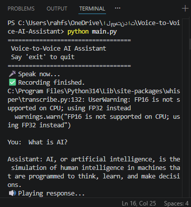

# Voice-to-Voice-AI-Assistant

## Overview
This project is a Voice-to-Voice AI Assistant developed using Python. It records the user's voice, converts the speech into text using OpenAI Whisper, sends the text to the Cohere Large Language Model (LLM) to generate a response, and finally converts the generated response back into speech using Google Text-to-Speech (gTTS).

The assistant provides a simple voice-based interaction where users can ask questions and receive spoken answers.

---

## Features
- Record voice input from the microphone.
- Convert speech to text using Whisper.
- Generate intelligent responses using Cohere AI.
- Convert text responses to speech using gTTS.
- Play the generated audio response automatically.
- Exit the assistant using commands such as "Bye", "Exit", or "Quit".

---

## Technologies Used
- Python
- OpenAI Whisper
- Cohere API
- Google Text-to-Speech (gTTS)
- SoundDevice
- SciPy
- python-dotenv
- playsound

---

## Project Structure

```
Voice-to-Voice-AI-Assistant/
│── main.py
│── speech_to_text.py
│── llm.py
│── text_to_speech.py
│── requirements.txt
│── README.md
│── .gitignore
│── output1.png
│── output2.png
```

---

## Installation

1. Clone the repository.

```bash
git clone https://github.com/rahfalh1/Voice-to-Voice-AI-Assistant.git
```

2. Install the required packages.

```bash
pip install -r requirements.txt
```

3. Create a `.env` file and add your Cohere API key.

```text
COHERE_API_KEY=YOUR_API_KEY
```

---

## How to Run

Run the following command:

```bash
python main.py
```

Speak into your microphone when prompted.

The assistant will:
1. Record your voice.
2. Convert speech to text.
3. Generate an AI response.
4. Convert the response to speech.
5. Play the generated audio automatically.

To exit the assistant, say:

- Bye
- Exit
- Quit
- Goodbye

---

## Workflow

```
User Voice
      │
      ▼
Speech-to-Text (Whisper)
      │
      ▼
Text
      │
      ▼
Cohere LLM
      │
      ▼
Generated Response
      │
      ▼
Text-to-Speech (gTTS)
      │
      ▼
Audio Response
```

---

## Screenshot

```


```

---

## Future Improvements

- Support continuous conversations with memory.
- Improve response speed.
- Add multilingual speech recognition.
- Support different AI models.
- Build a graphical user interface (GUI).

---

## Author

Rahaf
